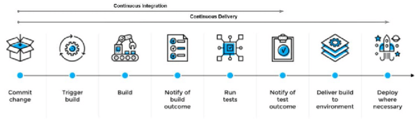

# CICD

CICD stands for Continuous Integration and Continuous Delivery, it is a practice where by a product is constantly being iterated upon until a desired outcome is achieved (usually an agreed upon product with certain features and functionalities).

